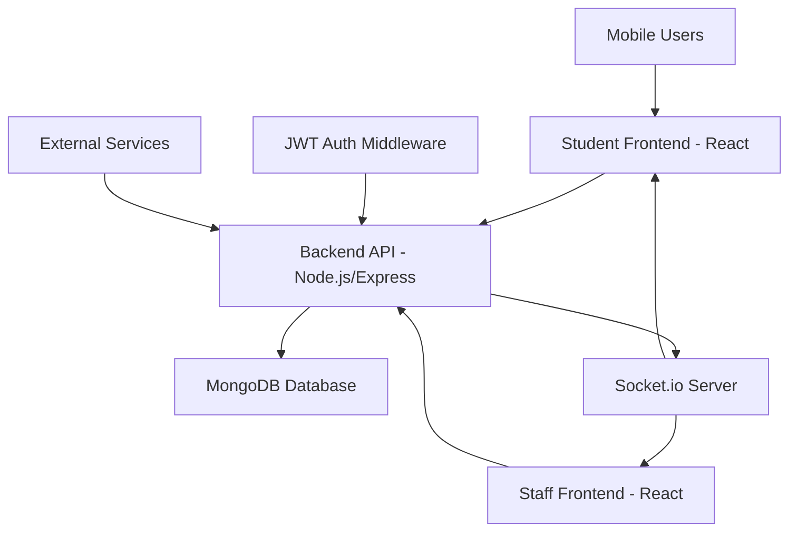

# Design Document

## Overview

The College Canteen Food Ordering System is a full-stack web application that enables students to order food online and staff to manage orders and menus efficiently. The system uses a modern tech stack with React.js frontends, Node.js/Express backend, MongoDB database, and Socket.io for real-time communication.

The architecture follows a microservices-inspired approach with separate frontend applications for users and staff, connected to a unified backend API that handles authentication, order management, and real-time updates.

## Architecture

### High-Level Architecture



### Technology Stack

**Frontend:**
- React.js 18+ with functional components and hooks
- Tailwind CSS for styling and responsive design
- Vite for build tooling and development server
- Socket.io-client for real-time communication
- React Router for navigation
- Axios for HTTP requests

**Backend:**
- Node.js with Express.js framework
- Socket.io for WebSocket communication
- JWT for authentication and authorization
- Bcrypt for password hashing
- Mongoose for MongoDB object modeling
- CORS middleware for cross-origin requests

**Database:**
- MongoDB with Mongoose ODM
- Collections: Users, MenuItems, Orders
- Indexes on frequently queried fields

**Deployment:**
- Frontend: Vercel/Netlify
- Backend: Railway/Render
- Database: MongoDB Atlas
- Environment-based configuration

## Components and Interfaces

### Frontend Architecture

#### Student Frontend Components
```
src/
├── components/
│   ├── common/
│   │   ├── Header.jsx
│   │   ├── Footer.jsx
│   │   └── LoadingSpinner.jsx
│   ├── auth/
│   │   ├── LoginForm.jsx
│   │   └── SignupForm.jsx
│   ├── menu/
│   │   ├── MenuList.jsx
│   │   ├── MenuItem.jsx
│   │   └── OrderCart.jsx
│   ├── orders/
│   │   ├── OrderTracking.jsx
│   │   ├── OrderHistory.jsx
│   │   └── OrderStatus.jsx
│   └── account/
│       └── ProfileInfo.jsx
├── pages/
│   ├── LoginPage.jsx
│   ├── MenuPage.jsx
│   ├── OrderTrackingPage.jsx
│   ├── AccountPage.jsx
│   └── OrderHistoryPage.jsx
├── context/
│   ├── AuthContext.jsx
│   └── SocketContext.jsx
├── hooks/
│   ├── useAuth.js
│   └── useSocket.js
└── utils/
    ├── api.js
    └── constants.js
```

#### Staff Frontend Components
```
src/
├── components/
│   ├── common/
│   │   ├── AdminHeader.jsx
│   │   └── AdminSidebar.jsx
│   ├── orders/
│   │   ├── OrderQueue.jsx
│   │   ├── ManualOrderForm.jsx
│   │   └── OfflinePaymentList.jsx
│   └── menu/
│       ├── MenuManager.jsx
│       ├── MenuItemForm.jsx
│       └── DealOfDaySelector.jsx
├── pages/
│   ├── AdminDashboard.jsx
│   ├── ManualOrderPage.jsx
│   ├── MenuManagementPage.jsx
│   ├── OrderQueuePage.jsx
│   └── OfflinePaymentPage.jsx
└── context/
    ├── AdminAuthContext.jsx
    └── AdminSocketContext.jsx
```

### Backend API Structure

#### Route Organization
```
routes/
├── auth.js          // POST /api/auth/login, /api/auth/signup
├── menu.js          // GET /api/menu, POST /api/menu (staff only)
├── orders.js        // GET /api/orders, POST /api/orders
├── staff.js         // Staff-specific routes
└── users.js         // User profile routes
```

#### API Endpoints

**Authentication Routes:**
- `POST /api/auth/signup` - User registration
- `POST /api/auth/login` - User login
- `GET /api/auth/verify` - Token verification

**Menu Routes:**
- `GET /api/menu` - Get available menu items
- `POST /api/menu` - Add menu item (staff only)
- `PUT /api/menu/:id` - Update menu item (staff only)
- `DELETE /api/menu/:id` - Delete menu item (staff only)
- `PUT /api/menu/:id/toggle` - Toggle item availability (staff only)

**Order Routes:**
- `GET /api/orders` - Get user's orders
- `POST /api/orders` - Place new order
- `GET /api/orders/:id` - Get specific order details
- `PUT /api/orders/:id/status` - Update order status (staff only)
- `GET /api/staff/orders` - Get all orders for staff
- `POST /api/staff/manual-order` - Create manual order (staff only)
- `PUT /api/staff/orders/:id/payment` - Confirm offline payment (staff only)

**User Routes:**
- `GET /api/users/profile` - Get user profile
- `PUT /api/users/profile` - Update user profile

### Socket.io Events

**Client to Server:**
- `join-order-room` - Join specific order tracking room
- `join-staff-room` - Join staff dashboard room

**Server to Client:**
- `order-status-updated` - Order status change notification
- `new-order` - New order notification to staff
- `payment-confirmed` - Payment confirmation notification
- `menu-updated` - Menu changes notification

## Data Models

### User Schema
```javascript
{
  name: { type: String, required: true },
  email: { type: String, required: true, unique: true },
  whatsapp: { type: String, required: true },
  password: { type: String, required: true }, // hashed
  role: { type: String, enum: ['student', 'staff'], default: 'student' },
  createdAt: { type: Date, default: Date.now }
}
```

### MenuItem Schema
```javascript
{
  name: { type: String, required: true },
  description: { type: String, required: true },
  price: { type: Number, required: true },
  available: { type: Boolean, default: true },
  isDealOfDay: { type: Boolean, default: false },
  dealPrice: { type: Number }, // discounted price for deal of day
  dealExpiresAt: { type: Date }, // auto-reset daily
  createdAt: { type: Date, default: Date.now }
}
```

### Order Schema
```javascript
{
  userId: { type: ObjectId, ref: 'User' }, // null for manual orders
  orderNumber: { type: String, unique: true }, // auto-generated
  customerName: { type: String, required: true },
  customerWhatsapp: { type: String, required: true },
  items: [{
    itemId: { type: ObjectId, ref: 'MenuItem', required: true },
    name: { type: String, required: true }, // snapshot for history
    price: { type: Number, required: true }, // snapshot for history
    quantity: { type: Number, required: true }
  }],
  totalAmount: { type: Number, required: true },
  status: { 
    type: String, 
    enum: ['payment pending', 'preparing ', 'ready', 'picked_up'], 
    default: 'payment pending' 
  },
  paymentMethod: { type: String, enum: ['online', 'offline'], required: true },
  paymentStatus: { 
    type: String, 
    enum: ['pending', 'confirmed'], 
    default: 'pending' 
  },
  isManualOrder: { type: Boolean, default: false },
  createdAt: { type: Date, default: Date.now },
  updatedAt: { type: Date, default: Date.now }
}
```

## Error Handling

### Frontend Error Handling
- Global error boundary for React components
- API error interceptors with user-friendly messages
- Form validation with real-time feedback
- Network error handling with retry mechanisms
- Socket connection error handling with reconnection logic

### Backend Error Handling
- Centralized error handling middleware
- Input validation using express-validator
- Database error handling with appropriate HTTP status codes
- JWT token validation with clear error messages
- Rate limiting to prevent abuse

### Error Response Format
```javascript
{
  success: false,
  error: {
    message: "User-friendly error message",
    code: "ERROR_CODE",
    details: {} // Additional error details for debugging
  }
}
```

## Testing Strategy

### Frontend Testing
- **Unit Tests:** Component testing with React Testing Library
- **Integration Tests:** API integration and user flow testing
- **E2E Tests:** Critical user journeys with Cypress
- **Socket Testing:** Real-time functionality testing

### Backend Testing
- **Unit Tests:** Individual function and middleware testing with Jest
- **Integration Tests:** API endpoint testing with supertest
- **Database Tests:** Model validation and query testing
- **Socket Tests:** WebSocket event handling testing

### Test Coverage Goals
- Minimum 80% code coverage for critical paths
- 100% coverage for authentication and payment logic
- Comprehensive testing of real-time features
- Mobile responsiveness testing across devices

### Testing Environment
- Separate test database for isolated testing
- Mock external services and APIs
- Automated testing in CI/CD pipeline
- Performance testing for concurrent users

## Security Considerations

### Authentication & Authorization
- JWT tokens with appropriate expiration times
- Password hashing with bcrypt (minimum 12 rounds)
- Role-based access control for staff features
- Secure session management

### Data Protection
- Input sanitization and validation
- SQL injection prevention through Mongoose
- XSS protection with proper data encoding
- CORS configuration for allowed origins

### API Security
- Rate limiting on authentication endpoints
- Request size limits to prevent DoS
- Secure headers with helmet.js
- Environment variable protection for secrets

## Performance Optimization

### Frontend Optimization
- Code splitting with React.lazy()
- Image optimization and lazy loading
- Caching strategies for menu data
- Optimized bundle sizes with tree shaking

### Backend Optimization
- Database indexing on frequently queried fields
- Connection pooling for MongoDB
- Caching for menu items with Redis (optional)
- Efficient Socket.io room management

### Real-time Performance
- Selective Socket.io event broadcasting
- Connection management and cleanup
- Efficient order status update propagation
- Minimal payload sizes for real-time updates